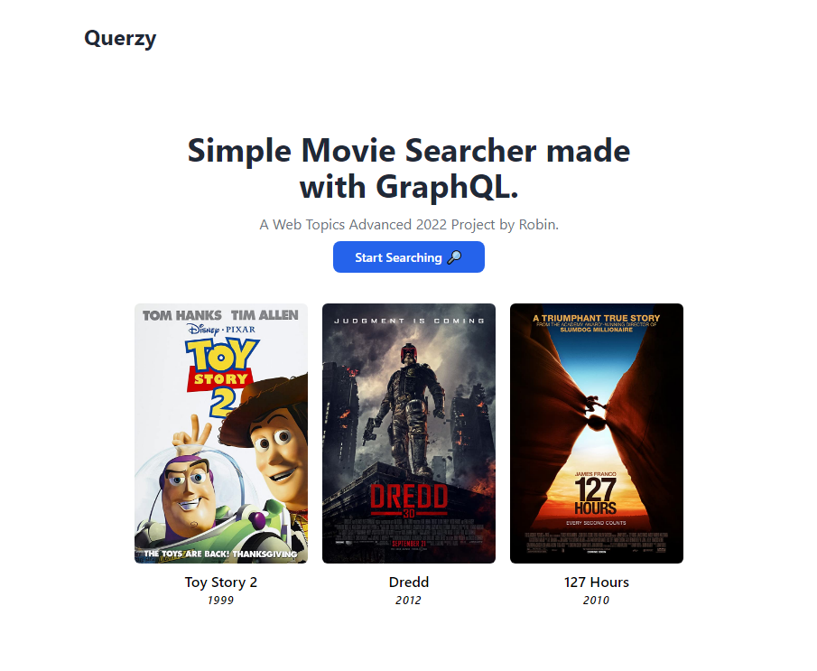

# Querzy
Simple Movie Searcher made with GraphQL.

> Project to showcase the MongoDB, GraphQL, SvelteKit & Tailwind CSS.



## Run this project locally

Follow the steps below to duplicate this project locally.

```bash
npm install
cd MovieQuery
npm run dev
```
You will also need to set the `API_KEY` variable in the `.env` file. This is the key used to authenticate the GraphQL requests.

## Running in the browser
I'm not very proud about the next part.. you need to disable CORS to view the project.

Accessing the GraphQL API directly requires a Bearer token which only can be obtained though a Mongo SDK that is not compatible with Svelte. Any other workarounds have failed.

For demo purposes I decided to use this workaround instead of rewriting the entire project to facilitate this issue.

```cmd
// e.g. Vivaldi
cd "C:\Program Files\Google\Chrome\Application"
vivaldi moviequery.pages.dev --disable-web-security --user-data-dir=vivaldi-profile-for-disabled-web-security

// e.g. Chrome
cd C:\Users\Robin\AppData\Local\Vivaldi\Application
chrome moviequery.pages.dev --disable-web-security --user-data-dir="C:\Windows\Temp"
```
## Other

### Custom Resolver Code
Custom code used in App services

Input Type:
```json
{
  "type": "object",
  "title": "SearchInput",
  "properties": {
    "title": {
      "type": "string"
    },
    "plot": {
      "type": "string"
    },
    "year": {
      "type": "integer"
    },
    "genres": {
      "type": "string"
    },
    "pagination": {
      "title": "PaginationInput",
      "type": "object",
      "properties": {
        "skip": {
          "type": "integer"
        },
        "limit": {
          "type": "integer"
        }
      }
    }
  }
}
```
Function:
```js
exports = async (searchInput) => {
    const cluster = context.services.get("mongodb-atlas");
    const movies = cluster.db("sample_mflix").collection("movies");
    
    let findStatement =  {};
      
    if (searchInput.hasOwnProperty('title')) {
      findStatement.title = {'$regex': searchInput.title, '$options': 'i'};
    }
    if (searchInput.hasOwnProperty('plot')) {
      findStatement.plot = {'$regex': searchInput.plot, '$options': 'i'};
    }
    if (searchInput.hasOwnProperty('year')) {
      findStatement.year = searchInput.year;
    }
    if (searchInput.hasOwnProperty('genres')) {
       findStatement.genres = {'$all': searchInput.genres.replace(/\s/g, '').split(",")};
    }
    
    let skip = 0;
    let limit = 10;
    
    if (searchInput.hasOwnProperty('pagination')) {
       let pageDetails = searchInput.pagination;
       
        if (pageDetails.hasOwnProperty('skip')) {
          skip = pageDetails.skip;
        }
        if (pageDetails.hasOwnProperty('limit')) {
          limit = pageDetails.limit;
        }
    }
    
    return movies.find(findStatement).sort({title: 1}).skip(skip).limit(limit).toArray();
};
```

### Custom MongoDB search indexes

```json
{
  "mappings": {
    "dynamic": true,
    "fields": {
      "title": {
        "dynamic": true,
        "type": "document"
      }
    }
  }
}
```

### MongoDB collection

The data that was used can be found in the `db_movies.json` file.

### CloudFlare version

The files that are deployed on the CloudFlare Pages site can be found in the `cf.zip` file.
